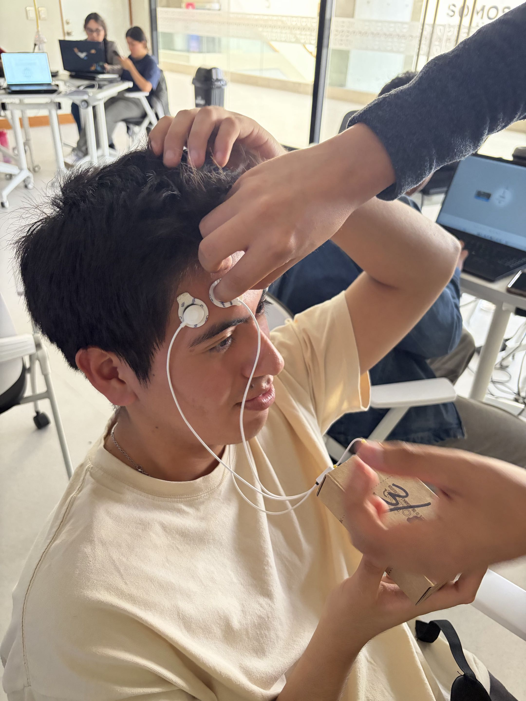
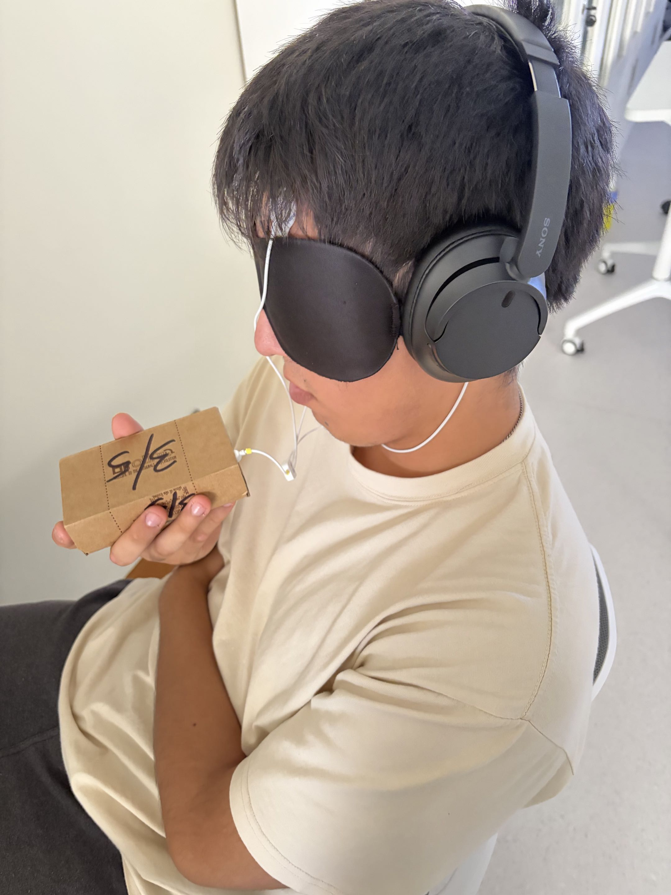
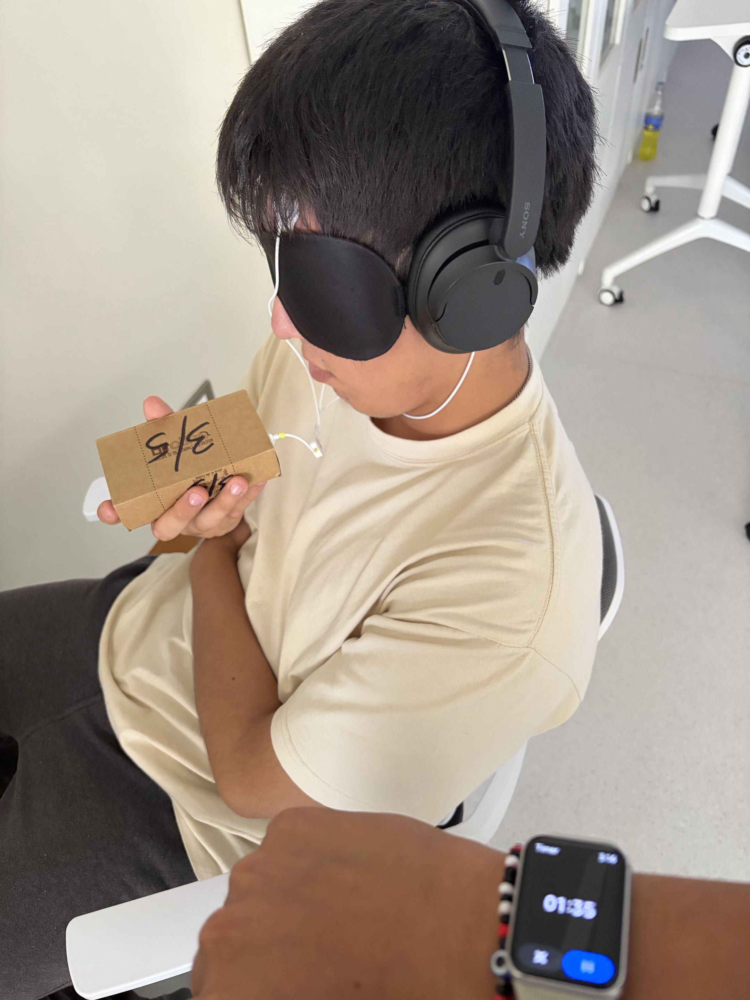
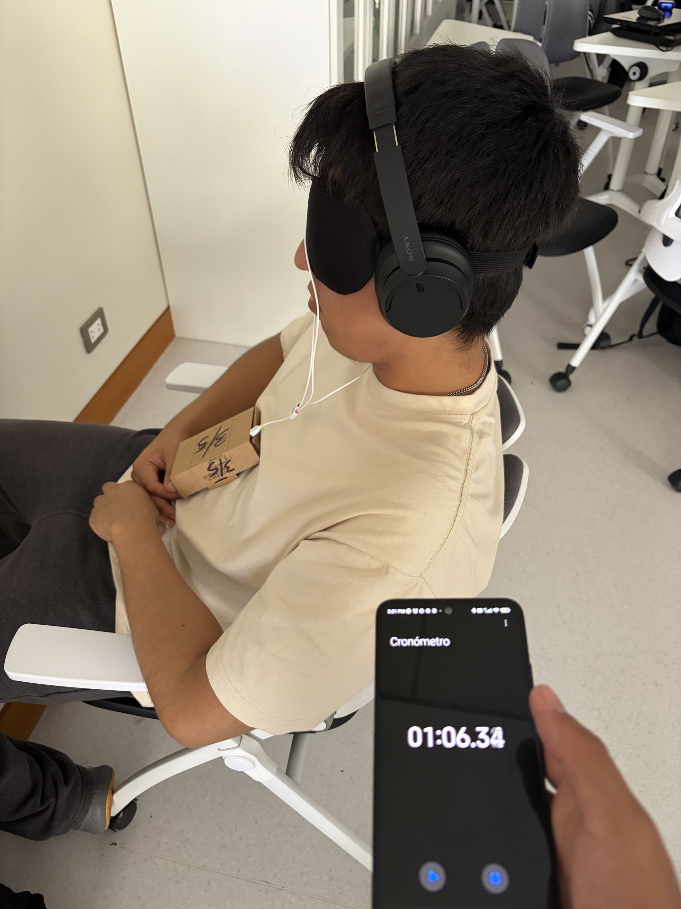

# LABORATORIO 6: USO DE BITALINO PARA ECG

## Índice

1. [Objetivos](#objetivos)
2. [Materiales y equipos](#materiales-y-equipos)
3. [Resultados](#resultados)
   - 3.1 [Conexión usada](#conexión-usada)
   - 3.2 [Video de la señal](#video-de-la-señal)
   - 3.3 [Ploteo de la señal en OpenSignal](#ploteo-de-la-señal-en-opensignal)
   - 3.4 [Archivos](#archivos)
   - 3.5 [Ploteo de la señal en Python](#ploteo-de-la-señal-en-python)
4. [Preguntas de la sesion](#preguntas-de-la-sesion)

## Objetivos
- Adquirir una señal electroencefalográfica (EEG) en tiempo real utilizando BITalino y OpenSignals.
- Reconocer los cambios de la señal durante el reposo, la apertura y cierre de los ojos y una tarea mental.
- Comparar el comportamiento de la señal frente a música suave y música fuerte.
- Relacionar las pruebas realizadas con las bandas de frecuencia delta, theta, alfa, beta y gamma.
- Identificar posibles artefactos producidos por movimientos de los ojos, músculos faciales o una mala conexión de los electrodos.

Las condiciones evaluadas fueron:
- Línea basal sin estímulos externos.
- Apertura y cierre de los ojos.
- Preguntas complejas resueltas mentalmente.
- Música suave.
- Música fuerte.

## Materiales y equipos
- BITalino (r)evolution Assembled Core BT.
- Sensor de electroencefalografía (EEG).
- Cable de referencia de un electrodo.
- Tres electrodos desechables autoadhesivos de Ag/AgCl con gel.
- OpenSignals (r)evolution.
- Adaptador Bluetooth.
- Audífonos.

## Procedimiento general
----- (falta)

## Resultados
Se empleó una conexión bipolar frontal. FP1 se utilizó como entrada positiva (IN+), FP2 como entrada negativa (IN−) y el electrodo de referencia se colocó detrás de la oreja.

  

## PRUEBA 1: Línea basal y apertura/cierre de ojos

#### A. Línea basal
El participante permaneció relajado, en silencio y sin estímulos externos durante aproximadamente uno a dos minutos. Se evitó el movimiento de la cabeza, los ojos y los músculos faciales para obtener una señal basal con la menor cantidad posible de artefactos.

  

#### B. Apertura y cierre de ojos
Después de registrar la línea basal, se realizaron cinco repeticiones de apertura y cierre de los ojos. Cada estado se mantuvo durante aproximadamente cinco segundos.

Esta prueba permitió comparar la señal obtenida con los ojos abiertos y cerrados. La actividad alfa suele presentar una mayor presencia durante la relajación con los ojos cerrados y disminuir al abrirlos. Sin embargo, este cambio se puede observar con mayor claridad mediante el análisis en frecuencia.

  

### Video de la señal 

#### A. Línea basal

#### B. Apertura y cierre de ojos

### Ploteo de la señal en OpenSignal
Para facilitar la visualización, se seleccionaron segmentos representativos de la línea basal y de los ciclos de apertura y cierre de ojos.

#### A. Línea basal

#### B. Apertura y cierre de ojos

### Archivos

### Ploteo de la señal en Python

#### A. Línea basal

#### B. Apertura y cierre de ojos

## PRUEBA 2: Preguntas complejas
Durante esta prueba se evaluó la señal EEG mientras el participante resolvía mentalmente cinco preguntas complejas. Para escuchar las indicaciones, se retiró uno de los audífonos. Cada pregunta tuvo una duración aproximada de 20 a 30 segundos.

El participante no respondió en voz alta y trató de mantener la cabeza, los ojos y los músculos faciales sin movimiento. El objetivo fue comparar la señal durante una tarea que requería atención y concentración con la señal obtenida durante la línea basal.

https://github.com/user-attachments/assets/3ac32c37-c18b-4bc2-b448-029a8ecd0cd7

### Video de la señal 

### Ploteo de la señal en OpenSignal
En la imagen se presenta la señal EEG registrada mientras el participante resolvía las cinco preguntas. Para facilitar su interpretación, se deben señalar los intervalos correspondientes a cada pregunta.

### Archivos

### Ploteo de la señal en Python

## PRUEBA 3: Música suave

Durante esta prueba, el participante escuchó música suave durante aproximadamente uno a un minuto y medio. Se mantuvo relajado y evitó realizar movimientos innecesarios.

El objetivo fue registrar la señal EEG frente a un estímulo auditivo de baja intensidad y compararla posteriormente con la línea basal y con la prueba de música estruendosa.

  

### Video de la señal 

### Ploteo de la señal en OpenSignal
En la siguiente imagen se presenta la señal EEG registrada mientras el participante escuchaba música suave.

### Archivos

### Ploteo de la señal en Python

## PRUEBA 4: Música fuerte (estruendosa)

Durante esta prueba, el participante escuchó música estruendosa durante aproximadamente uno a un minuto y medio. Se mantuvieron las mismas condiciones de postura y conexión utilizadas durante la prueba de música suave.

El objetivo fue comparar la señal EEG obtenida con ambos estímulos auditivos. Para realizar esta comparación se debe considerar que los cambios también pueden estar relacionados con la atención, el tipo de música y los movimientos involuntarios del participante.

https://github.com/user-attachments/assets/1a4c9c3c-34a6-4660-af5a-29180aa9f87b

### Video de la señal 

### Ploteo de la señal en OpenSignal
En la siguiente imagen se presenta la señal EEG registrada mientras el participante escuchaba música estruendosa.

### Archivos

### Ploteo de la señal en Python

## Preguntas de la sesión

   - **¿Cuáles son las frecuencias significativas para la adquisición de señales de EEG?¿Son las mismas en todas las áreas cerebrales?** 
   Las bandas de frecuencias del EEG no son exactamente las mismas en tods las áreas cerebrales. Las bandas de frecuencia son las mismas como clasificación general, pero su potencia y predominancia pueden variar según la región cerebral, el estado del sujeto y la tarea realizada. Por ejemplo, la actividad alfa suele observarse con mayor claridad en regiones posteriroes, mientras que otras actividades pueden presentar mayor predominancia en regiones frontales.
   Las principales bandas de frecuencia del EEG son:
   - Delta (δ): Esta banda tiene una frecuencia aproximda de 0.5-4Hz y se asocia al sueño profundo
   - Theta (θ): La banda tiene una frecuencia de 4-8Hz y principalmente se asocia a la somnolencia, memoria y procesos cognitivos
   - Alpha (α): Con una frecuencia aproximada de 8-13Hz y se asocia a la relajación, especialmente con ojos cerrados
   - Beta (β): La banda Beta tiene una frecuencia de entre 13-30Hz y se asocia a la actividad mental, atención y concentración.
   - Gamma (γ): Enta banda abarca frecuencias mayores a 30Hz y se asocia a procesos cognitivos y percepción. 

   - **¿Qué tipo de filtro es esencial al trabajar con señales de EEG?¿Por qué es necesario aplicar dicho filtro?** 
   El filtro pasa banda (band-pass) es fundamental para el procesamiento del EEG, ya que permite conservar el rango de frecuencias de interés y atenuar componentes no deseados que distorsionen mi señal.
   Por ejemplo, dependiendo de lo que se quiera, puede utilizarse un rango de entre 0.5-40Hz para conservar las principales bandas del EEG y reducir ruido de alta frecuencia (>40Hz), deriva de la línea base y artefactos de muy baja frecuencia (<0.5Hz). Tambien, por la interferencia de red eléctrica, puede ser neceario un filtro de notch para reducir el ruido.
   
   - **¿Es posible influir en la señal de EEG mediante los pensamientos?¿Qué acción se puede realizar para activar una banda de frecuencia específica?¿Fue posible visualizar el cambio en la señal**  
   Sí, los pensamientos y estados mentales pueden modificar la actividad cerebral que registra el EEG, aunque no significa que podamos controlar voluntariamente una banda de frecuencia con precisión absoluta.
   Dando ejemplos de acciones que puedan activar una banda de frecuencia específica, si nos relajamos y cerramos los ojos, se puede aumenta la actividad alfa, especialmente en regiones posteriores; si nos concentramos en una tarea mental, se puede modificar principalmente la actividad beta dependiendo de la tarea.
   Por último, sí, el puede puede visualizarse en el EEG, aunque normalmente es más evidente al analizar la potencia de una banda mediante un espectro de frecuencia o un análisis tiempo-frecuencia que simplemente observando la señal cruda. Por ejemplo, al comparar ojos abiertos vs. ojos cerrados (como en el laboratorio), puede observarse un incremento de la potencia alfa durante los ojos cerrados.

   - **Muestre una captura de pantalla de una parte relevante de los datos de EEG obtenidos en el experimento propuesto.¿Corresponde esta señal a lo que esperaba?¿Por qué?** (WILL)
  
   
   - **¿Existe alguna diferencia en la señal entre las dos ubicaciones, FP1 y FP2?** 
   
   FP1 está ubicado en la zona frontal izquierda y FP2 en la zona frontal derecha, por lo que pueden registrar diferencias relacionadas con la actividad de cada lado del cerebro. También pueden verse afectados de manera distinta por los movimientos de los ojos y de los músculos de la frente.

   Sin embargo, en nuestro montaje FP1 y FP2 no se registraron como señales separadas. FP1 se utilizó como entrada positiva y FP2 como entrada negativa de un mismo canal bipolar. Por lo tanto, la señal obtenida representa la diferencia de potencial entre ambos puntos. Para comparar cada ubicación por separado sería necesario utilizar dos canales o realizar adquisiciones independientes manteniendo la misma referencia.

   - **Que frecuencias deberían variar durante las tareas planteadas?¿Es posible observar cambios específicos en la señal en bruto (RAW)? Describa lo que observa**
   
   Durante la apertura y cierre de ojos se espera principalmente una variación de la banda alfa, la cual suele aumentar cuando la persona se encuentra relajada y con los ojos cerrados. Al abrir los ojos, esta actividad puede disminuir.

   Durante las preguntas complejas pueden presentarse cambios en las bandas theta y beta, debido a que la persona se encuentra realizando una tarea mental que requiere atención y concentración. Para las pruebas de música suave y música estruendosa no se puede relacionar directamente una sola banda sin analizar los resultados obtenidos.

   En la señal RAW se observaron variaciones de amplitud y de forma entre las pruebas. Sin embargo, no es posible reconocer claramente una banda de frecuencia solamente observando la señal en bruto. Algunos cambios también pueden deberse al parpadeo, al movimiento de los ojos, a la actividad de los músculos faciales o al contacto de los electrodos. Por eso, es necesario complementar la señal RAW con el análisis en frecuencia.

   - **Según su criterio, ¿la amplitud de la señal de EEG se corresponde con el nivel de concentración aplicado?**
   
   No necesariamente. Una mayor amplitud en la señal EEG no significa directamente que la persona se encuentre más concentrada. La amplitud también puede cambiar por el movimiento de los ojos, la actividad de los músculos faciales, la posición de los electrodos o el contacto de estos con la piel.

  

